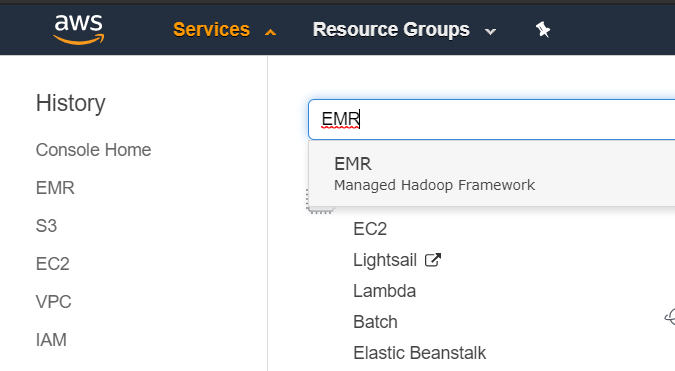
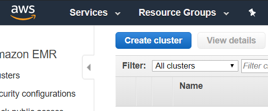
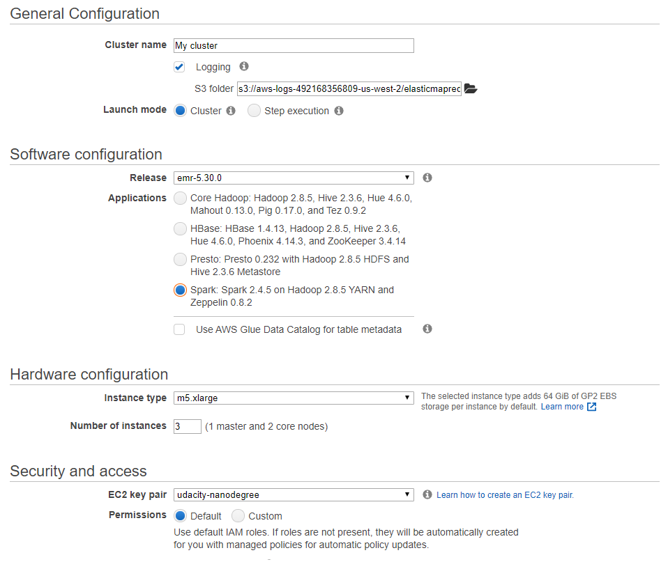

# Sparkify Analytics - Udacity Project 4

<p align="center">
  
</p>

This time, we will help Sparkify to implement an analytics environemnt with Spark, using s3 as storage. We will work with Sparkify data to create a dimensional model and storage it in partitioned parquet format on s3.

## Prerequisites

You'll need to [create an AWS account](https://aws.amazon.com/pt/premiumsupport/knowledge-center/create-and-activate-aws-account/), to create a EMR Cluster.

*Attention: You should be charged for the services that you use, check the [AWS pricing](https://aws.amazon.com/pt/pricing/) in order to not be surprised while creating your environment.*

[Create an IAM user](https://docs.aws.amazon.com/directoryservice/latest/admin-guide/setting_up_create_iam_user.html) (use a name of your choice) and save its [access key and secret key](https://docs.aws.amazon.com/IAM/latest/UserGuide/id_credentials_access-keys.html) credentials (do not share it). Then [atach the policy](https://docs.aws.amazon.com/IAM/latest/UserGuide/access_policies_manage-attach-detach.html) **AdministratorAccess** for this user.

## Datasets

You'll be working with two datasets that reside in S3, that was provided by Udacity:

* Song data: `s3://udacity-dend/song_data`
* Log Data: `s3://udacity-dend/log_data`

Log data json path: s3://udacity-dend/log_json_path.json

The star schema was created following the same structure of [Sparkify - Project 1](https://github.com/brunorochax/udacity_project1).

## Configuration File and ETL Script

* dl.cfg: Configuration file with AWS credentials.
* etl.py: Script for copy datasets from s3, create dimensional tables and write them to s3 again, in parquet format.

Open dl.cfg and save your access key and secret key inside it:

```
[AWS]
AWS_ACCESS_KEY_ID=
AWS_SECRET_ACCESS_KEY=
```

After change, copy both files inside a bucket on your AWS Account.

## Creating EMR Cluster

On your AWS Account go to EMR Service:



Click on "Create cluster" button:



On next window, use the follow configurations (you could reduce o increase machines size if you want), select key pair that you've created and click on "Create cluster", on bottom of page:



## Running Scripts

After cluster creation, we need to connect on it. Open your cluster page summary and click on SSH, there you'll see a ssh command, run it on your machine:

```
ssh -i ~/YOUR_PEM_FILE.pem hadoop@YOUR_MACHINE_IP.us-west-2.compute.amazonaws.com
```

Then you'll connect on your EMR master node:


Let's copy our dl.cfg and etl.py in our cluster.

```
$ mkdir sparkify
$ cd sparkify
$ aws s3 cp s3://YOUR_BUCKET/dl.cfg .
$ aws s3 cp s3://YOUR_BUCKET/etl.py .
```

And now, run your etl.py:

```
$ spark-submit ./etl.py
```

## Authors 

This project and data were created and provisioned by udacity.com on Data Engineering Nanodegree.